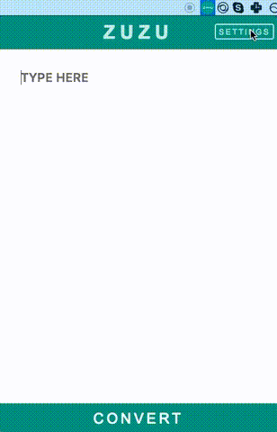

# ZuZu Electron

> Zawgyi <=> Unicode Converter that lives in your menu bar.



## Install

- [mac](https://github.com/AungMyoKyaw/zuzu-menubar-app/releases/latest)
- [window](https://github.com/AungMyoKyaw/zuzu-menubar-app/releases/latest)

## User Guide

### Toggle ZUZU

- <kbd>command</kbd>+<kbd>shift</kbd>+<kbd>space</kbd> [mac]
- <kbd>control</kbd>+<kbd>shift</kbd>+<kbd>space</kbd> [window]

### Convert

- <kbd>command</kbd>+<kbd>enter</kbd> [mac]
- <kbd>control</kbd>+<kbd>enter</kbd> [window]

### Open Preference

- <kbd>command</kbd>+<kbd>,</kbd> [mac]
- <kbd>control</kbd>+<kbd>,</kbd> [window]

### Close App

- <kbd>command</kbd>+<kbd>q</kbd> [mac]
- <kbd>alt</kbd>+<kbd>f4</kbd> [window]

## Development

```shell
npm install
npm start
```

## Build

```shell
npm run build
```

## Built with

- Electron
- React
- Redux
- React Router

## License

MIT © [Aung Myo Kyaw](https://github.com/AungMyoKyaw)
